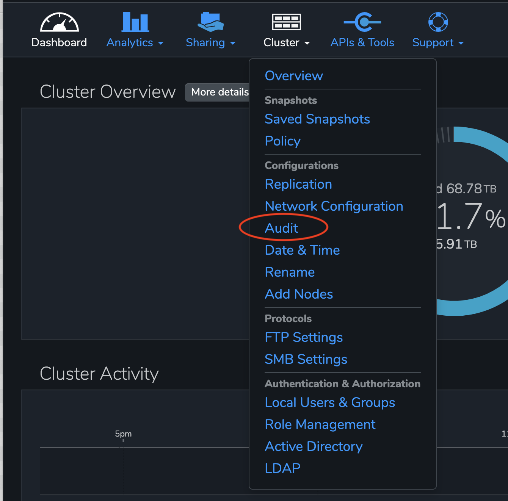
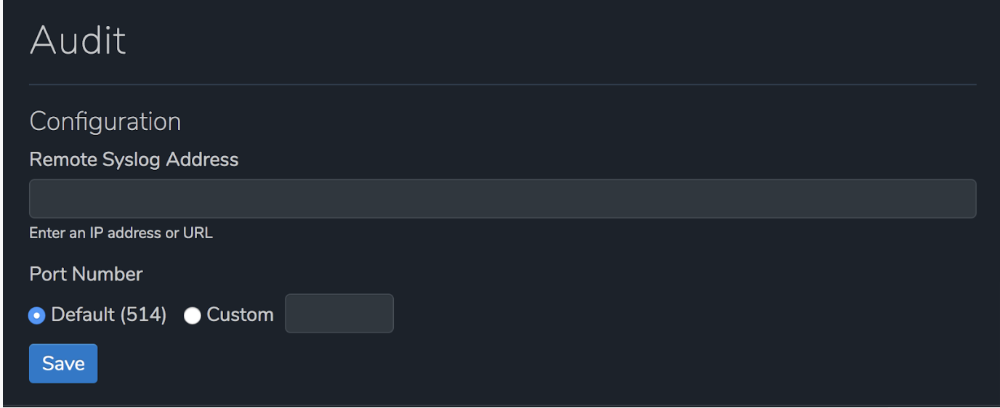
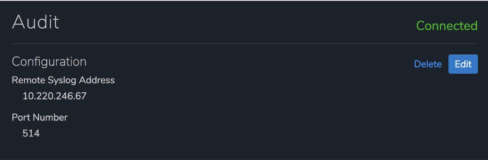

# Configuring rsyslog on Ubuntu 18.04 to Store and Forward or change protocol to UDP

## Table of Contents

   * [Qumulo Audit Logging](#qumulo-audit-logging)
   * [Log Field Definitions](#log-field-definitions)
   * [Why Store and Forward?](#why-store-and-forward)
   * [Why would I use UDP for rsyslog data?](#why-would-i-use-udp-for-rsyslog-data)
   * [Configuration with rsyslog](#configuration-with-rsyslog)
   * [Enable Audit Logging via the UI](#enable-audit-logging-via-the-ui)
   * [Enable Audit Logging via the CLI](#enable-audit-logging-via-the-cli)
      
## Qumulo Audit Logging

Audit Logging in Qumulo Core provides a mechanism for tracking filesystem operations and configuration
changes. As connected clients issue requests to the cluster, log messages are generated describing
each attempted operation. These log messages are then sent over the network to the remote syslog instance
specified by the current audit configuration in compliance with
[RFC 5424](https://tools.ietf.org/html/rfc5424).

Each audit log message body consists of a few fields in CSV (comma delimited) format. Note that the user id
and both file path fields are quoted since they may contain characters that need to be escaped. In addition
to escaping characters, we also strip all newline characters ("\n" or "\r") from these three fields.

The fields are described below in the order that they display within the log message body:

```
10.220.200.26,groot-1,"AD\alice",smb2,fs_read_data,ok,123,"/Mike/docs/image.png",""
```

## Log Field Definitions

The fields within the log file entries are:

**User IP** - The IP address of the user in IPV4/IPV6 format

**Node** - The node in the Qumulo cluster that generated the log entry

**User ID** - The user that performed the action. The user id can be of the form:

- AD username
- Qumulo local username
- POSIX UID
- Windows SID
- Qumulo auth ID (only if Qumulo fails to resolve the user ID to any of the previous types)

**Logins** - Any successful or unsuccessful login attempt by the user for the operation below:

- Session login via the Web UI
- Session login via the qq CLI
- SMB login
- NFS mount
- FTP login

**Protocol** - The protocol that the user request came through

- nfs3
- nfs4
- smb2
- smb3
- ftp
- api

**File System Operation** - The operation that the user attempted

- fs_create_directory
- fs_create_file
- fs_create_hard_link
- fs_create_symlink
- fs_create (a filetype other than the types capture above)
- fs_delete
- fs_fsstat
- fs_read_metadata
- fs_list_directory
- fs_open
- fs_read_data
- fs_read_link
- fs_rename
- fs_write_data
- fs_write_metadata

**Management Operation** - Any operation that modified the cluster configuration

- auth_create_user
- smb_create_share
- smb_login
- nfs_create_export
- nfs_mount
- snapshot_create_snapshot
- replication_create_source_relationship

**Error Status** - "ok" if the operation succeeded or a Qumulo specified error code if the operation failed.

Keep in mind that error status codes are subject to change with new releases of Qumulo Core and may differ
depending on the version you have installed on your cluster

<table>
  <tr>
    <th>**Error Status**</th>
    <th>**Details**</th>
  </tr>
  <tr>
    <td>ok</td>
    <td>The operation was successful.</td>
  </tr>
  <tr>
    <td>fs_no_such_path_error</td>
    <td>The directory portion of the path contains a name that doesn't exist.</td>
  </tr>
  <tr>
    <td>fs_no_space_error</td>
    <td>The file system has no available space. Your cluster is 100% full.</td>
  </tr>
  <tr>
    <td>fs_invalid_file_type_error</td>
    <td>The operation isn't valid for this filetype.</td>
  </tr>
  <tr>
    <td>fs_not_a_file_error</td>
    <td>The operation (e.g. read) is only valid for a file.</td>
  </tr>
  <tr>
    <td>fs_sharing_violation_error</td>
    <td>The file or directory is opened by another party in an exclusive manner.</td>
  </tr>
  <tr>
    <td>fs_no_such_entry_error</td>
    <td>The directory, file, or link does not exist in the file system.</td>
  </tr>
  <tr>
    <td>fs_access_denied_error</td>
    <td>The user does not have access to perform the operation.</td>
  </tr>
  <tr>
    <td>fs_access_perm_not_owner_error</td>
    <td>The user would need superuser or owner access to perform the operation.</td>
  </tr>
  <tr>
    <td>fs_entry_exists_error</td>
    <td>A file system object with the given name already exists.</td>
  </tr>
  <tr>
    <td>fs_directory_not_empty_error</td>
    <td>The directory cannot be removed because it is not empty.</td>
  </tr>
  <tr>
    <td>fs_no_such_inode_error</td>
    <td>The file system object does not exist.</td>
  </tr>
  <tr>
    <td>http_unauthorized_error</td>
    <td>The user does not have access to perform the management operation.</td>
  </tr>
  <tr>
    <td>share_fs_path_doesnt_exist_error</td>
    <td>The directory does not exist on the cluster.</td>
  </tr>
  <tr>
    <td>decode_error</td>
    <td>Invalid json was passed to the API.</td>
  </tr>
</table>

**File id** - The ID of the file that the operation was on

**File path** - The path of the file that the operation was on

When accessing a file through a snapshot, the path is prefixed with a "/.snapshot/<snapshot-directory>";
which is the same path prefix used to access snapshot files via nfs and smb.

**Secondary file path** - Any rename or move operations

**IMPORTANT!!** In order to keep the amount of audit log message to a minimum, similar operations performed
in rapid succession will be de-duplicated. For example, if a user reads the same file 100,000 times in a
minute, only one message corresponding to the first read will be generated.

## Why Store and Forward?

There are several reasons why you may wish to store and forward your logging information from rsyslog.

1. You wish to aggregate all of your logs onto one machine. This is known as log aggregation.
2. There is a requirement to change the log format for log aggregation.
3. Qumulo only uses TCP as the delivery mechanism for rsyslog, but your application requires UDP.

With the exception of number 3 (UDP protocol), it is possible to store and forward all of your
logs. By this, we mean that if the log receiver is down, you can store the logs and deliver them
at a later date or time.

## Why would I use UDP for rsyslog data?

The rsyslogd daemon was originally configured to use UDP for log forwarding to reduce overhead. While UDP
is an unreliable protocol, it's streaming method does not require the overhead of establishing a network
session. This protocol also reduces network load as the network stream requires no receipt verification
or window adjustment.

You may find that UDP is preferred if:

1. The receiving device does not support TCP delivery
2. The receiving device, or hosting network, are severely resource limited
3. The logs being delivered are considered low priority

WHen choosing UDP log delivery, it is important to keep in mind that there is no message delivery
verification or **recovery**. So, while the likelihood of data loss may not be high, logs can be
missed due to network packet loss.

The idea of **store and forward** does not really exist with UDP delivery since there is no
acknowledgement of UDP packets and, hence, no way to forward a log that might not have been
received.

### Why would you say **store and forward** with UDP

In actual fact, **store and forward** will only work with TCP because of the message
acknowledgement and the tracking of which messages have been forwarded to the receiver. We have
kept the name because it is possible that you wish to aggregate mesaages into applications like

1. Splunk
2. ElasticSearch
3. Other log aggregators

and if those aggregators are down for whatever reason, you wish to make sure that the logs will eventually
get there when those aggregators restart.

## Configuration with Rsyslog

For the following example, our client will be running Ubuntu 18.04. If you are using a different version
of Linux, you may need to Google how to configure rsyslog for specifics.

### Global rsyslog configuration

Start by updating the global rsyslog configuration to allow receiving syslog messages over TCP connections.
In the **/etc/rsyslog.conf** file, uncomment the following lines to listen for TCP connections on port 514.
If you choose to use a different port, then also change the port referenced to match your desired
configuration.

```
# provides TCP syslog reception
module(load="imtcp")
input(type="imtcp" port="514")
```

### Create new Qumulo Audit Log configuration

Rsyslog loads dedicated log file format definitions from the **/etc/rsyslog.d** directory. We will need
to create a new configuration file for defining the Qumulo Audit Log format.

As part of this distribution, you will find a file called **rsyslog.d/10-qumulo-store-and-forward.conf**.
Simply copy this file into **/etc/rsyslog.d**. Once that file is copied, using your favorite text based
editor, edit that file.

Towards the bottom of the file, you will see a filter (see below example). You need to change the **omfwd**
definition so that the forwarding occurs to the correct **Target**. This example uses **10.220.246.28** and
this is the IP that will need to be changed. Additionally, you can change the **Protocol** from udp to tcp
if you wish to enable **store and forward** log shipping if the receiver is down for any reason.

```
# Filter to catch all Qumulo audit log messages.
if ($app-name startswith "qumulo") then {
action(type="omfwd" Target="10.220.246.28" Port="514" Protocol="udp" template="QumuloAuditFormat"
               queue.spoolDirectory="/var/log/qumulo"
               queue.type="LinkedList"
               queue.filename="StoreForward.queue"
               action.resumeRetryCount="-1"
               queue.saveOnShutdown="on")
stop
}
```

### /var/log/qumulo directory and permissions

The rsyslog configuration file included in this example depends upon the
directory **/var/log/qumulo** existing and having the correct permissions.

Create the directory if it doesn't already exist.

```
mkdir -p /var/log/qumulo
```

Make sure to apply the correct permissions so that the syslog daemon can write to it.

```
chown syslog.adm /var/log/qumulo
```

### Restart the rsyslog daemon

In order for the new Qumulo Audit Log configuration to be active, you must first restart the
rsyslog daemon on the server.

```
systemctl restart rsyslog
```

## Enable Audit Logging via the UI

Now that you have configured the rsyslog server to receive Qumulo Audit Logs, it is time to configure
the Qumulo cluster to communicate with the rsyslog server that you just configured.

1. Start by clicking on the **Cluster** menu and click **Audit**.

<p align="center">

</p>

2. Fill in the following fields:

- **Remote Syslog Address** - The IP address or URL of your rsyslog server.
- **Port Number** - The port number that you configured for your rsyslog server.

<p align="center">

</p>

3. Click **Save**

4. Certify that the status shows as **Connected** and that all configuration details are correct
on the Audit page.

If you need to change the configuration, click the **Edit** button to modify the settings or select
**Delete** to disable audit logging on your cluster.

<p align="center">

</p>

## Enable Audit Logging via the CLI

Run the following qq command, including a specific IP address (or URL) and port number, to enable
Audit Logging:

```
qq audit_set_config --enable --server-address <syslog-server-hostname> --server-port <port-number>
```

To disable audit logging, use the following command:

```
qq audit_set_config --disable
```

To review the current configuration for audit logging, run the following:

```
qq audit_get_config
```

Sample Output:

```
qq audit_get_config
{
"enabled": true,
"server_address": "10.220.200.26",
"server_port": 514
}
```

Use the qq command below to check the current state of the connection with the remote syslog instance:

```
qq audit_get_status
```

The connection_status included in the output will be one of the following:

- **AUDIT_LOG_CONNECTED** - The connection with the remote syslog instance has been established and all
log messages should be successfully transmitted.
- **AUDIT_LOG_DISCONNECTED** - There is no active connection to the remote syslog instance. The cluster will
attempt to buffer all outgoing log messages until the connection can be re-established, at which point the
buffered messages will be sent to the remote syslog instance. If a power outage or reboot occurs, all
unsent messages will be lost. If the message buffer fills up, all new messages will be thrown away.
- **AUDIT_LOG_DISABLED** - Audit logging has been explicitly disabled.

Check out the sample output of an established syslog instance below:

```
qq audit_get_status
{
"connection-status": "AUDIT_LOG_CONNECTED"
}
```

## Verify Store and Forward (if protocol is NOT udp)

Since we have configured **/var/log/qumulo** as the directory in which we want to store the Store
and Forward logs, verifying that everything is working correctly is quite simple.

In order to view if logs are being written, login to the Ubuntu server where you configured rsyslog. Then,
run the command:

```
ls -l /var/log/qumulo
```

Understand that you will **ONLY** see store and forward logs if you are using the TCP protocol
and the receiver is not running. Otherwise, this directory will be empty.

```
root@dq2-b-40g:/var/log/qumulo# ls -lt
total 7164
-rw------- 1 syslog syslog     593 Feb  3 16:55 StoreForward.queue.qi
-rw------- 1 syslog syslog 1014310 Feb  3 16:55 StoreForward.queue.00000008
-rw------- 1 syslog syslog 1049161 Feb  3 16:55 StoreForward.queue.00000007
-rw------- 1 syslog syslog 1049026 Feb  3 16:55 StoreForward.queue.00000006
-rw------- 1 syslog syslog 1048733 Feb  3 16:55 StoreForward.queue.00000005
-rw------- 1 syslog syslog 1048580 Feb  3 16:55 StoreForward.queue.00000004
-rw------- 1 syslog syslog 1048877 Feb  3 16:55 StoreForward.queue.00000003
-rw------- 1 syslog syslog 1048708 Feb  3 16:55 StoreForward.queue.00000002
```
